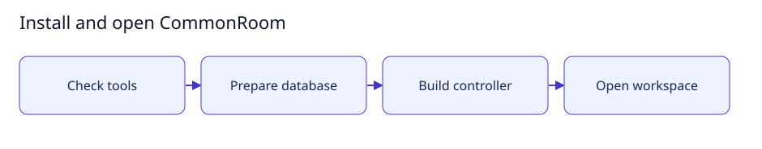

# Install and open CommonRoom

[User documentation](README.md) · [Technical reference](../technical/README.md)



Guide illustration; current availability is described below.

## Before you start

Use Go 1.26+, PostgreSQL and a current browser. Development checks also use Node.js
and Python 3.8+. Run commands from the repository root. Keep database URLs and
provider credentials outside documents and screenshots.

## Set up

1. Run `bash scripts/setup.sh --check` to check build prerequisites.
2. Prepare separate migration and runtime database roles using the
   [database contract](../technical/archive/database-security.md).
3. Set `MIGRATION_DATABASE_URL` privately and run `bash scripts/setup.sh --migrate`.
4. Apply the runtime grants as a database administrator **connected to the same
   database named in the migration URL**. Use an explicit database and port:

   ```bash
   # Example only: replace commonroom and 5432 with your database and port.
   psql -p 5432 -d commonroom -v ON_ERROR_STOP=1 -f runtime-grants.sql
   ```

   Save the grants from the linked database procedure in `runtime-grants.sql`.
   Run the command under your administrator's approved authentication method.
   `GRANT CONNECT ON DATABASE` does not switch the current database. Plain
   `psql < runtime-grants.sql` can select the wrong database and report that
   `public.events` does not exist. Migrate first, then apply grants to that database.
5. In the runtime terminal, set `DATABASE_URL` to the restricted runtime role and
   run `bash scripts/setup.sh --start`.
6. Open `http://127.0.0.1:8787` and complete owner-key setup. Save the key privately.

## First owner and later sign-ins

An empty installation shows **Set up your owner account**, not a request for a PEM
you do not yet have. CommonRoom generates an RSA-3072 key pair and records the
public key in the database. Read the private setup code from `.data/owner-key`
on the server, enter it, and download your generated private PEM. The code proves
you control the installation; it prevents another browser visitor claiming it.
Choose **Sign in with saved key** to verify your download. The temporary server
private-key copy and setup code are removed after successful key sign-in.

A returning installation shows normal PEM sign-in, including on a new device.
A failed PEM never creates a replacement owner. Existing database history with
missing owner-key files refuses automatic key creation instead of resetting access.
Keep the private PEM and its backup secure; it is never stored in database events.
The header displays the server address you are actually using. **Help** remains
available before sign-in. Header and sign-in Help links show a box-and-arrow icon
and open a separate browser tab or window, keeping the sign-in page in place.

## Expected result

You can sign in and open the workspace. A running controller does not establish
that an agent worker, code execution, storage quotas or file delivery is ready.
For platform-specific packages, use the [retained installation procedure](../technical/archive/installation.md).

## Small setup helper

With the controller already running, this read-only helper checks Help is reachable
and prints the page to open. It does not enable features, send tasks or change data.

```bash
bash scripts/user-guide.sh getting-started
```
